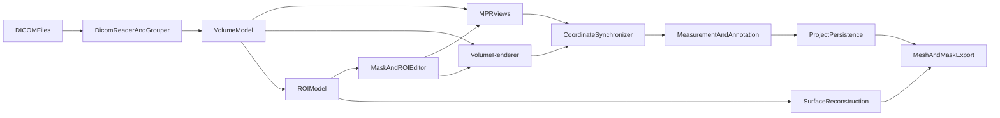

# Nghiên cứu xây dựng phần mềm hỗ trợ trực quan hóa và thao tác ảnh CT 3D

> Đề tài: Nghiên cứu xây dựng phần mềm hỗ trợ trực quan hóa và thao tác ảnh CT 3D
> Mã nguồn nền: InVesalius 3 – `https://github.com/invesalius/invesalius3`
> Điểm mới tập trung: lớp tương tác 2D–3D và chỉnh sửa vùng quan tâm (Region Of Interest – ROI) tích hợp trên InVesalius

---

## Mục lục

1. [Đặt vấn đề và tính cấp thiết](#1-đặt-vấn-đề-và-tính-cấp-thiết)
2. [Tổng quan khoa học](#2-tổng-quan-khoa-học)
3. [Cơ sở lý thuyết và công nghệ](#3-cơ-sở-lý-thuyết-và-công-nghệ)
4. [Phân tích mã nguồn InVesalius và khoảng trống](#4-phân-tích-mã-nguồn-invesalius-và-khoảng-trống)
5. [Mục tiêu, đối tượng và phạm vi](#5-mục-tiêu-đối-tượng-và-phạm-vi)
6. [Câu hỏi nghiên cứu và giả thuyết](#6-câu-hỏi-nghiên-cứu-và-giả-thuyết)
7. [Phương pháp nghiên cứu](#7-phương-pháp-nghiên-cứu)
8. [Kiến trúc prototype và phạm vi MVP](#8-kiến-trúc-prototype-và-phạm-vi-mvp)
9. [Yêu cầu chức năng, phi chức năng và tiêu chí nghiệm thu](#9-yêu-cầu-chức-năng-phi-chức-năng-và-tiêu-chí-nghiệm-thu)
10. [Thiết kế thực nghiệm](#10-thiết-kế-thực-nghiệm)
11. [Sản phẩm, tiến độ và quản trị rủi ro](#11-sản-phẩm-tiến-độ-và-quản-trị-rủi-ro)
12. [Dự kiến đóng góp mới và ý nghĩa khoa học](#12-dự-kiến-đóng-góp-mới-và-ý-nghĩa-khoa-học)
13. [Cách trình bày và tuân thủ học thuật](#13-cách-trình-bày-và-tuân-thủ-học-thuật)
14. [Tài liệu tham khảo gợi ý](#14-tài-liệu-tham-khảo-gợi-ý)
15. [Phụ lục](#15-phụ-lục)

---

## Tóm tắt đề tài

Đề tài phát triển một prototype phần mềm trực quan hóa và tương tác ảnh cắt lớp vi tính (CT) 3D dựa trên mã nguồn mở InVesalius 3, tập trung vào một lớp tích hợp gồm: quản lý chuỗi DICOM, hiển thị đa mặt phẳng (MPR – Axial/Coronal/Sagittal), tái tạo và tương tác mô hình 3D, công cụ phân đoạn và chỉnh sửa vùng quan tâm (ROI), đo lường và annotation, quản lý phiên làm việc, lưu dự án và xuất kết quả. Điểm mới ở cấp độ hệ thống là kiến trúc đồng bộ không gian chung giữa 2D và 3D cùng cơ chế chỉnh sửa ROI hai chiều–ba chiều trên một mô hình trạng thái dùng chung, có lịch sử thao tác và quy trình đo lường/annotation gắn với tọa độ thế giới. Nghiên cứu sử dụng khung Design Science Research Methodology (DSRM) kết hợp với nghiên cứu thực nghiệm và nghiên cứu người dùng; đánh giá tập trung vào tính đúng đắn về không gian, tính tái lập, hiệu năng, tính đầy đủ chức năng và khả năng sử dụng. Sản phẩm là một prototype nghiên cứu, không sử dụng cho chẩn đoán lâm sàng.

---

## Abstract (dự kiến)

This graduate thesis proposes and develops a research prototype for visualizing and interacting with 3D computed tomography (CT) images. The prototype is built on top of the open-source InVesalius 3 platform and concentrates on a coherent layer for DICOM series management, multi-planar reconstruction, 3D surface reconstruction and interaction, basic segmentation, region-of-interest (ROI) editing, measurements, annotation, session persistence, and result export. The novelty lies in a system-level contribution: a unified spatial synchronization between the Axial, Coronal, Sagittal views and the 3D viewer together with a two-dimensional and three-dimensional ROI editing layer that operates on a shared, versioned state. The research follows the Design Science Research Methodology and is complemented by quantitative experiments and a usability study. Evaluation focuses on spatial correctness, reproducibility, performance, functional completeness, and usability, while explicitly avoiding any claim of clinical validity.

---

## Danh mục ký hiệu và thuật ngữ

- CT: Computed Tomography – cắt lớp vi tính.
- DICOM: Digital Imaging and Communications in Medicine – chuẩn lưu trữ và truyền ảnh y tế.
- MPR: Multi-Planar Reconstruction – tái tạo đa mặt phẳng.
- ROI: Region Of Interest – vùng quan tâm.
- Mask: mặt nạ nhị phân đánh dấu vùng voxel thuộc ROI.
- HU: Hounsfield Unit – đơn vị thang xám chuẩn của CT.
- VTK: Visualization Toolkit – thư viện hình ảnh học.
- WL/WW: Window Level/Window Width – tham số hiển thị thang xám.
- FPS: Frame Per Second – số khung hình trên giây.
- DSRM: Design Science Research Methodology – phương pháp nghiên cứu thiết kế.
- SUS: System Usability Scale – thang đo tính khả dụng.
- NASA-TLX: NASA Task Load Index – chỉ số gánh nặng công việc.
- DICE: Dice similarity coefficient – chỉ số tương đồng giữa hai tập voxel.
- IoU/Jaccard: Intersection over Union – chỉ số giao trên hợp.
- HD95: 95th percentile Hausdorff Distance – khoảng cách Hausdorff phân vị 95.
- ASSD: Average Symmetric Surface Distance – khoảng cách bề mặt đối xứng trung bình.

---

## 1. Đặt vấn đề và tính cấp thiết

Ảnh CT 3D là dữ liệu cốt lõi trong nhiều chuyên ngành lâm sàng và nghiên cứu y học: chẩn đoán hình ảnh, lập kế hoạch phẫu thuật, can thiệp tối thiểu xâm lấn, nghiên cứu giải phẫu, in 3D mô hình giải phẫu, định vị trong phẫu thuật thần kinh, v.v. Trong thực hành, người dùng không chỉ cần xem lát cắt 2D mà còn cần định vị, đo đạc, phân đoạn và tái tạo các cấu trúc giải phẫu để hỗ trợ quan sát, thảo luận đa chuyên khoa và ra quyết định. Tuy nhiên, nhiều công cụ thương mại đóng gói kín, khó tùy biến cho nghiên cứu, và chi phí bản quyền là rào cản. Mặt khác, các công cụ mã nguồn mở hiện có thường phức tạp về tích hợp hoặc chưa cung cấp một luồng thống nhất giữa hiển thị đa mặt phẳng, chỉnh sửa ROI và xuất kết quả phục vụ nghiên cứu.

InVesalius 3 là phần mềm mã nguồn mở (GPLv2, Centro de Pesquisas Renato Archer) cho phép tái tạo 3D từ chuỗi DICOM 2D và đã có các chức năng nền tảng: đọc DICOM/Analyze/NIfTI/PAR/REC, hiển thị Axial/Coronal/Sagittal, volume rendering, segmentation dựa trên threshold và watershed, chỉnh sửa mask 2D và 3D bằng cọ vẽ, đo khoảng cách và góc, quản lý surface, xuất STL/PLY/OBJ/VTP/3MF và lưu dự án `.inv3`. Đây là nền tảng thuận lợi để nghiên cứu mở rộng.

Tuy nhiên, trong InVesalius hiện tại, các thao tác giữa mặt phẳng 2D và mô hình 3D vẫn có độ rời rạc nhất định, chỉnh sửa ROI chưa có một lớp trung gian rõ ràng đảm bảo tính nhất quán không gian giữa mask 2D, bề mặt 3D và các mặt cắt liên quan; thiếu quy trình đo lường–annotation gắn với một mô hình tọa độ thế giới duy nhất; thiếu cơ chế undo/redo mạnh cho chỉnh sửa 3D và chưa có đánh giá thực nghiệm có hệ thống. Đó chính là “khoảng trống” mà đề tài hướng tới.

Tính cấp thiết của đề tài thể hiện ở ba khía cạnh:

1. Khoa học: bổ sung một đóng góp cấp hệ thống về tích hợp trực quan hóa–tương tác–đo lường–annotation trong y sinh, có thể lượng hóa bằng chỉ tiêu không gian và chỉ tiêu tiện dụng.
2. Thực tiễn: cung cấp một prototype mã nguồn mở, có thể tái lập, giúp giảm chi phí và thời gian thiết lập môi trường cho các nghiên cứu y học cần thao tác ảnh CT 3D.
3. Đào tạo: phù hợp cho luận văn cao học với phạm vi kiểm soát được, có dữ liệu mẫu, có hạ tầng kỹ thuật rõ ràng và có thể đánh giá trong khuôn khổ thời gian cho phép.

---

## 2. Tổng quan khoa học

### 2.1. Ảnh CT 3D và quy trình tạo ảnh

CT ghi nhận hình ảnh cắt ngang cơ thể theo các lát có độ dày xác định; mỗi voxel mang giá trị HU đặc trưng cho mức hấp thụ tia X của mô. Chuỗi ảnh CT hai chiều xếp chồng tạo thành khối ảnh ba chiều với spacing đặc trưng theo ba trục. Chuẩn DICOM quy định cách lưu trữ ảnh, metadata và chuyển giao dữ liệu giữa các thiết bị.

### 2.2. Trực quan hóa 2D và 3D

- Hiển thị 2D: MPR tái tạo các mặt phẳng Axial, Coronal, Sagittal và các mặt phẳng xiên tùy ý; tham số WL/WW điều chỉnh độ tương phản/thang xám phù hợp với từng mô.
- Hiển thị 3D: hai hướng chính là surface rendering (Marching Cubes, Flying Edges, marching squares cho 2D) và volume rendering (raycasting, shear-warp, texture-based). Volume rendering hiển thị trực tiếp khối voxel với hàm truyền màu và hàm độ trong suốt; surface rendering chuyển mask thành mesh tam giác để hiển thị/tương tác/xuất.

### 2.3. Phân đoạn và ROI

- Phân đoạn dựa trên cường độ: dùng khoảng HU đặc trưng của mô (bone, muscle, fat, lung).
- Phân đoạn dựa trên vùng: watershed, region growing, connected components.
- Phân đoạn dựa trên biên: edge-based, active contours.
- Phân đoạn dựa trên học sâu: U-Net, nnU-Net, 3D U-Net, các biến thể transformer.
- Chỉnh sửa ROI: cọ vẽ 2D, cọ vẽ 3D, polygon cut, morphology, interpolation giữa các lát.

### 2.4. Tương tác 2D–3D và chỉnh sửa ROI

Các nghiên cứu và công cụ thương mại (3D Slicer, MITK, OsiriX/Horos, Mimics) đều cung cấp đồng bộ giữa MPR và 3D. Điểm khác biệt nằm ở: (a) khả năng biên tập ROI trực tiếp trên cả 2D và 3D trong cùng một phiên; (b) khả năng lan truyền thay đổi đến tất cả view; (c) hỗ trợ undo/redo phiên bản mạnh; (d) khả năng đo và annotation gắn với tọa độ thế giới.

### 2.5. Đo lường và annotation

Phép đo khoảng cách, diện tích và thể tích là yêu cầu cốt lõi trên ảnh y tế. Trong 3D, thể tích bề mặt được tính qua diện tích tam giác và mật độ đỉnh. Annotation có thể là điểm (fiducial), đường (polyline), vùng (region) hoặc văn bản. Để bảo toàn ngữ nghĩa và liên kết giữa các phép đo, cần gắn chúng với một mô hình tọa đa tham chiếu thống nhất.

### 2.6. Tình hình nghiên cứu trong nước

InVesalius đã được sử dụng trong các nghiên cứu giải phẫu, lập kế hoạch phẫu thuật và in 3D tại Việt Nam. Tuy nhiên, các nghiên cứu tập trung vào một lớp tích hợp 2D–3D có đánh giá định lượng và quy trình người dùng chuẩn hóa cho đề tài cao học còn hạn chế. Đề tài sẽ đóng góp vào khoảng trống này.

---

## 3. Cơ sở lý thuyết và công nghệ

### 3.1. Mô hình voxel và hệ tọa độ

- Khối ảnh được biểu diễn bằng mảng ba chiều `(Nx, Ny, Nz)` với spacing `(sx, sy, sz)`, origin `(ox, oy, oz)` và direction `(dxx, dxy, dxz, dyx, dyy, dyz, dzx, dzy, dzz)`.
- Quan hệ voxel ↔ thế giới: `world = origin + direction @ (voxel_index * spacing)`.
- Quan hệ thế giới ↔ voxel: nghịch đảo của ma trận trên.

### 3.2. Window/Level

Ánh xạ giá trị voxel sang giá trị hiển thị 8-bit dựa trên:

`display = clamp((voxel - (level - window/2)) / window, 0, 1) * 255`.

### 3.3. Tái tạo bề mặt

Marching Cubes (Lorensen–Cline) và biến thể Flying Edges tạo mesh tam giác từ trường scalar. Sau đó có thể áp dụng smoothing, decimation và remeshing.

### 3.4. Volume rendering

Kỹ thuật raycasting mô phỏng tia sáng đi qua voxel theo hướng nhìn, lấy mẫu và tích lũy màu/độ trong suốt theo hàm truyền.

### 3.5. Công nghệ nền tảng

- Python 3.12 (theo `pyproject.toml`).
- wxPython cho GUI.
- VTK 9.3 cho hiển thị và xử lý hình ảnh.
- NumPy, SciPy, scikit-image cho xử lý mảng và morphology.
- GDCM cho DICOM.
- PyACVD, lib3mf cho remeshing và xuất mesh.
- Tiện ích mở rộng Rust qua maturin (đã có trong `invesalius_rs/`).

### 3.6. Khung phương pháp nghiên cứu

Sử dụng Design Science Research Methodology (Peffers et al.) gồm sáu vòng: xác định vấn đề và động cơ; xác định mục tiêu giải pháp; thiết kế và phát triển artifact; trình diễn; đánh giá; truyền thông. Bổ sung các phương pháp:

- Nghiên cứu tài liệu để tổng quan khoa học và công nghệ.
- Phân tích kiến trúc phần mềm (mô hình tĩnh, mô hình động, mô hình triển khai).
- Nghiên cứu thực nghiệm (đo đạc, so sánh).
- Nghiên cứu người dùng với SUS, NASA-TLX, phỏng vấn ngắn.

---

## 4. Phân tích mã nguồn InVesalius và khoảng trống

### 4.1. Bức tranh tổng thể

InVesalius 3 đã có hạ tầng đủ mạnh cho đề tài:

- Khởi động và điều phối: `app.py` (lớp `InVesalius`, `Inv3SplashScreen`, `main`), `invesalius/control.py` (lớp `Controller`).
- Mô hình dữ liệu: `invesalius/project.py` (Singleton `Project` chứa `mask_dict`, `surface_dict`, `measurement_dict`, `raycasting_preset`), `invesalius/session.py`, `invesalius/data/slice_.py` (Singleton `Slice`, memmap), `invesalius/data/mask.py` (lớp `Mask`).
- Nhập dữ liệu: `invesalius/reader/dicom.py` (header), `invesalius/reader/dicom_reader.py` (`LoadDicom`, `ProgressDicomReader`), `invesalius/reader/dicom_grouper.py` (`DicomPatientGrouper`, `DicomGroup`, `PatientGroup`).
- Hiển thị 2D: `invesalius/data/viewer_slice.py`, `invesalius/data/slice_data.py`, `invesalius/data/styles.py`.
- Hiển thị 3D: `invesalius/data/viewer_volume.py`, `invesalius/data/volume.py` (`vtkOpenGLGPUVolumeRayCastMapper`, `vtkFixedPointVolumeRayCastMapper`), `invesalius/data/volume_widgets.py`.
- MPR và crosshair: `invesalius/data/orientation.py`, `invesalius/data/volume_widgets.py`, `invesalius/data/styles.py` (`OnScrollBar` cập nhật đồng bộ slice khác).
- Window/Level: `invesalius/data/styles.py` (`OnWindowLevelMove`), `invesalius/data/styles_3d.py` (`OnWindowLevelMove` trên raycasting), `invesalius/data/slice_.py` (`do_ww_wl`).
- Mask, chỉnh sửa và undo/redo: `invesalius/data/mask.py` (`as_vtkimagedata`), `invesalius/data/volume_mask.py`, `invesalius/data/mask3d_editor_state.py` (lớp `Mask3DEditorState` quản lý brush 3D, polygon cut, undo/redo).
- Đo và annotation: `invesalius/data/measures.py` (`MeasureData`, các lớp đo khoảng cách/góc/đa giác), `invesalius/math_utils.py` (`calc_polygon_area`, `calc_ellipse_area`, `calculate_distance`).
- Tái tạo và xuất mesh: `invesalius/data/surface.py` (`Surface`, `SurfaceManager`), `invesalius/segmentation/watershed_process.py`, hỗ trợ STL (binary/ASCII), PLY, OBJ, VRML, VTP, 3MF, X3D.
- Lưu/đọc dự án: `invesalius/project.py` (`SavePlistProject`, `OpenPlistProject`, `export_project`), `invesalius/session.py` (config, recent projects, crash recovery).
- Tăng tốc Rust: `invesalius_rs/` (brush mask song song, floodfill/jump flooding, mesh smoothing, MIP, mask cut, polygon-to-mask).
- Kiểm thử hiện có: `tests/test_dicom_loading.py`, `tests/test_mask.py`, `tests/test_segmentation_tools.py`, `tests/test_mesh_generation.py`, `tests/test_stl_export.py`, `tests/test_ply_export.py`, `tests/test_vtp_export.py`, `tests/test_3mf.py`, `tests/test_bone_thresholding.py`.

### 4.2. Khoảng trống cần lấp

Khoảng trống phù hợp với mục tiêu đề tài cao học:

1. Chưa có một “dịch vụ tọa đa tham chiếu chung” (`VolumeCoordinateService`) cung cấp API thống nhất giữa voxel ↔ world ↔ patient cho cả 2D và 3D; hiện các hàm chuyển đổi phân tán trong `data/coordinates.py`, `data/transformations.py`, `data/imagedata_utils.py`, `data/styles.py`.
2. Chưa có cơ chế “đồng bộ thao tác hai chiều” giữa mask 2D và bề mặt 3D ở cấp kiến trúc; các thao tác vẫn gắn với widget cụ thể (`Mask3DEditorState` chỉ phục vụ chỉnh sửa 3D, các mask 2D qua `Mask.edit_mask_pixel`).
3. Chưa có một mô hình “trạng thái ROI có phiên bản” (`ROIModel`) cho phép hoàn tác mọi thao tác, snapshot và so sánh trước/sau.
4. Chưa có quy trình “đo và annotation gắn tọa độ thế giới” với metadata đầy đủ (đơn vị, ngày đo, người đo, mô tả); đo và annotation hiện nằm trong `measures.py` và `annotation_dict` của `Project`.
5. Chưa có đánh giá thực nghiệm có hệ thống về độ chính xác không gian, hiệu năng, tính đầy đủ chức năng và tính khả dụng.
6. Hạ tầng kiểm thử đang thiếu test cho chỉnh sửa 3D, đồng bộ 2D–3D, measurement, annotation, persistence.

### 4.3. Đánh giá rủi ro kỹ thuật từ mã nguồn

- Singleton tràn lan (`Project`, `Slice`, `Session`, `Mask`) khiến việc tách module khó; cần kế thừa có chọn lọc.
- Pub/Sub dùng chuỗi topic (`invesalius/pubsub/pub.py`) – khi thêm topic mới cần đặt tên nhất quán và bảo đảm không vòng lặp.
- GUI phụ thuộc `wx.App` toàn cục, không có API Python public ổn định – đề tài sẽ không đóng gói như thư viện mà dùng trực tiếp trong app.
- Tài liệu nội bộ chưa đầy đủ ở một số module – đề tài sẽ bổ sung chú thích trong quá trình tích hợp.
- Giấy phép GPLv2 yêu cầu khi phân phối phải giữ thông báo bản quyền, công bố thay đổi, cung cấp mã nguồn – đề tài sẽ tuân thủ.

---

## 5. Mục tiêu, đối tượng và phạm vi

### 5.1. Mục tiêu tổng quát

Nghiên cứu và xây dựng một ứng dụng phần mềm trực quan hóa, tương tác và thao tác với dữ liệu ảnh CT 3D, hỗ trợ người dùng (bác sĩ, cán bộ kỹ thuật y tế, nghiên cứu sinh) quan sát và khai thác trực quan dữ liệu CT theo không gian ba chiều.

### 5.2. Mục tiêu cụ thể

1. Phân tích tổng quan ảnh CT 3D và mã nguồn InVesalius.
2. Xây dựng module quản lý và hiển thị dữ liệu CT (DICOM/series, MPR, Window/Level).
3. Xây dựng chức năng tái tạo và tương tác mô hình 3D (volume/surface rendering, camera, picking, crosshair).
4. Xây dựng chức năng phân đoạn và chỉnh sửa vùng quan tâm (threshold, watershed, brush/erase 2D–3D, undo/redo, interpolation).
5. Xây dựng đo lường, annotation, quản lý phiên làm việc, lưu và xuất kết quả.
6. Thiết kế giao diện người dùng và đánh giá prototype theo tiêu chí kỹ thuật và tiện dụng.

### 5.3. Đối tượng và phạm vi

- Đối tượng: người dùng nghiên cứu, kỹ thuật viên y tế, bác sĩ chẩn đoán hình ảnh (tham gia đánh giá tiện dụng).
- Phạm vi dữ liệu: ảnh CT, ưu tiên CT xương, mô mềm, phổi; dữ liệu đã ẩn danh hoặc công khai.
- Phạm vi chức năng: MVP gồm 12 nhóm chức năng bắt buộc (xem mục 8); nhóm mở rộng sẽ được cân nhắc nếu còn thời gian.
- Phạm vi phân phối: prototype nội bộ, chạy trên Windows, phân phối mã nguồn theo GPLv2 tuân thủ giấy phép InVesalius.

### 5.4. Ngoài phạm vi

- Không xây dựng hệ thống PACS/HIS.
- Không hỗ trợ MRI/PET/SPECT.
- Không tích hợp AI tự động chẩn đoán.
- Không xây dựng chức năng điều hướng phẫu thuật thần kinh (neuronavigation) – InVesalius đã có nhưng ngoài phạm vi đề tài.

---

## 6. Câu hỏi nghiên cứu và giả thuyết

### 6.1. Câu hỏi nghiên cứu

- **RQ1**: Kiến trúc tích hợp dựa trên InVesalius có đọc, nhóm, chuẩn hóa và hiển thị đúng một chuỗi CT trong ba mặt phẳng Axial/Coronal/Sagittal và mô hình 3D hay không?
- **RQ2**: Cơ chế đồng bộ tọa độ và thao tác có duy trì được quan hệ giữa mask 2D, bề mặt 3D và các mặt cắt sau khi chỉnh sửa hay không?
- **RQ3**: Các công cụ phân đoạn (threshold, brush/erase 2D và 3D, watershed, connected components, morphology, undo/redo) có tạo ROI ổn định, tái lập và đo được diện tích/thể tích hay không?
- **RQ4**: Prototype có đạt các tiêu chí về thời gian phản hồi, tài nguyên, độ chính xác phép đo, khả năng lưu/xuất và mức độ dễ sử dụng trong điều kiện thử nghiệm đã xác định hay không?

### 6.2. Giả thuyết

- **H1**: Sử dụng một mô hình tọa đa tham chiếu chung và một trạng thái mask dùng chung giúp giảm sai lệch khi chuyển đổi giữa 2D và 3D so với các thao tác rời rạc hiện có trong InVesalius mặc định.
- **H2**: Tích hợp 2D–3D và cập nhật bất đồng bộ theo vùng giúp giảm thời gian thao tác và số bước lặp trong các kịch bản ROI cố định.
- **H3**: Cơ chế undo/redo có phiên bản giúp phục hồi trạng thái mask 2D–3D về điểm bất kỳ trong phiên làm việc với chi phí bộ nhớ kiểm soát được.
- **H4**: Prototype đạt chỉ tiêu tiện dụng (SUS ≥ 70/100, NASA-TLX ở mức trung bình) trong nghiên cứu người dùng nhỏ (5–10 người).

### 6.3. Phạm vi kiểm chứng

- Khẳng định định lượng về tính chính xác phép đo và độ chính xác đồng bộ 2D–3D được thực hiện trên dữ liệu phantom và bộ dữ liệu CT công khai/ẩn danh.
- Không thực hiện kiểm chứng lâm sàng, không so sánh với chẩn đoán chuyên gia như một tiêu chí chính.

---

## 7. Phương pháp nghiên cứu

### 7.1. Khung phương pháp

Áp dụng Design Science Research Methodology (DSRM, Peffers et al.) gồm sáu bước:

1. Xác định vấn đề và động cơ (problem identification and motivation).
2. Xác định mục tiêu giải pháp (objectives of a solution).
3. Thiết kế và phát triển artifact (design and development).
4. Trình diễn (demonstration).
5. Đánh giá (evaluation).
6. Truyền thông (communication).

Bổ sung:

- Nghiên cứu tài liệu (literature review) theo phương pháp mapping review.
- Phân tích kiến trúc phần mềm (mô hình tĩnh, động, triển khai).
- Nghiên cứu thực nghiệm (controlled experiment với baseline).
- Nghiên cứu người dùng (usability study với SUS, NASA-TLX, phỏng vấn ngắn).

### 7.2. Quy trình nghiên cứu đề xuất

1. Tổng quan tài liệu về CT 3D, DICOM, MPR, volume rendering, segmentation/ROI, tọa đa ảnh–thế giới, giao diện người dùng và tiêu chí đánh giá.
2. Phân tích InVesalius theo mô hình hiện trạng – khoảng trống – nhu cầu; lập ma trận truy vết từ yêu cầu nghiên cứu đến module/hàm/kiểm thử.
3. Thu thập và chuẩn bị dữ liệu CT đã ẩn danh hoặc công khai; ghi nhận modality, series UID, kích thước, spacing, orientation, Window/Level, số lát, mức độ khó.
4. Thiết kế kiến trúc lớp tích hợp (xem mục 8) và xác định giao diện (API/PubSub) với core.
5. Phát triển prototype theo giai đoạn nhỏ, mỗi giai đoạn có tiêu chí nghiệm thu và log lỗi.
6. Kiểm thử chức năng, hồi quy, hiệu năng, độ chính xác hình học, lưu/đọc lại và xuất/đọc lại mesh.
7. Đánh giá người dùng theo thiết kế crossover hoặc trước–sau với kịch bản cố định; bổ sung phỏng vấn ngắn.
8. Tổng hợp kết quả, đối chiếu giả thuyết, viết báo cáo.

### 7.3. Phương pháp thu thập dữ liệu

- Dữ liệu CT công khai/ẩn danh (≥ 10–20 series, đa vùng giải phẫu, đa kích thước/spacing).
- Phantom ảnh tổng hợp có công thức hình học chuẩn (sphere, ellipsoid, box, oblique plane) để kiểm tra đo lường và tái tạo.
- Nhật ký thao tác người dùng (thời gian, số bước, số undo) và bảng khảo sát SUS/NASA-TLX.

### 7.4. Phương pháp phân tích

- Thống kê mô tả (trung bình, độ lệch chuẩn, trung vị).
- Kiểm định phù hợp (t-test/Wilcoxon/ANOVA) khi cỡ mẫu cho phép; thận trọng khi cỡ mẫu nhỏ.
- Trực quan hóa bằng biểu đồ hộp (boxplot), histogram và bảng tổng hợp.
- Phân tích định tính bằng mã hóa mở cho câu trả lời phỏng vấn.

### 7.5. Rủi ro nghiên cứu và biện pháp giảm

- Cỡ mẫu nhỏ: thận trọng khi khái quát hóa; bổ sung phân tích định tính.
- Dữ liệu công khai không đa dạng: bổ sung phantom và dữ liệu đối chiếu bên trong đơn vị (nếu được phép).
- Người dùng chưa quen phần mềm: bố trí buổi tập huấn ngắn và tách hiệu ứng học.
- Bias xác nhận: ghi nhận kết quả âm tính, mô tả chi tiết lỗi và ngoại lệ.

---

## 8. Kiến trúc prototype và phạm vi MVP

### 8.1. Nguyên tắc thiết kế

- Tích hợp trên InVesalius bằng cách bổ sung các ranh giới module có trách nhiệm rõ ràng, không viết lại core.
- Một mô hình tọa đa tham chiếu chung cho voxel, world và patient.
- Một trạng thái ROI có phiên bản, hỗ trợ undo/redo và snapshot.
- Đồng bộ hai chiều 2D–3D có khóa sự kiện để tránh vòng lặp.
- Tách bạch lớp dữ liệu/điều khiển/giao diện để dễ kiểm thử và thay thế GUI.

### 8.2. Sơ đồ kiến trúc

### 8.3. Mô tả các thành phần

- **DicomReaderAndGrouper**: bọc `invesalius/reader/dicom_reader.py` và `invesalius/reader/dicom_grouper.py`; cung cấp danh sách patient/study/series và chọn series cho session.
- **VolumeModel**: bọc `Slice` (`invesalius/data/slice_.py`) và `Volume` (`invesalius/data/volume.py`); cung cấp ma trận voxel, spacing, origin, direction, WL/WW, hằng số ảnh.
- **MPRViews**: bọc ba `viewer_slice` cho Axial/Coronal/Sagittal và widget crosshair.
- **VolumeRenderer**: bọc `viewer_volume.py`; quản lý raycast và surface overlay.
- **ROIModel**: trạng thái ROI có phiên bản; danh sách ROI với id, tên, màu, opacity, nhãn, mask (numpy), bounding box, lịch sử.
- **MaskAndROIEditor**: bọc các interactor style trong `styles.py`, `styles_3d.py`, `mask3d_editor_state.py`; bổ sung undo/redo thống nhất.
- **CoordinateSynchronizer**: bọc `data/coordinates.py`, `data/transformations.py`; cung cấp API voxel↔world↔patient và khóa đồng bộ.
- **MeasurementAndAnnotation**: bọc `data/measures.py`; bổ sung metadata (đơn vị, ngày, mô tả, người đo).
- **ProjectPersistence**: bọc `project.py` (SavePlistProject/OpenPlistProject) và bổ sung cơ chế lưu trạng thái ROI/measurement phiên bản.
- **SurfaceReconstruction**: bọc `data/surface.py`, `segmentation/watershed_process.py`; dùng `vtkFlyingEdges3D` hoặc `vtkMarchingCubes`, làm sạch bằng smoothing/decimation.
- **MeshAndMaskExport**: bọc `SurfaceManager._export_surface`; hỗ trợ STL/PLY/OBJ/VTP/3MF, xuất mask (NIfTI/NRRD), xuất annotation (JSON/HDF5).

### 8.4. Phạm vi MVP (12 nhóm chức năng bắt buộc)

1. Đọc dữ liệu DICOM (CT) – `LoadDicom`, `DicomPatientGrouper`.
2. Quản lý CT series – danh sách series, metadata, chọn series, hủy/lưu.
3. Hiển thị Axial/Coronal/Sagittal – `viewer_slice` + `orientation` + crosshair.
4. Dựng mô hình CT 3D – `viewer_volume` + `vtkOpenGLGPUVolumeRayCastMapper` hoặc surface.
5. Tương tác mô hình 3D – rotate/pan/zoom/reset, pick điểm/cấu trúc.
6. Window/Level – tương tác chuột hoặc slider trên MPR và 3D.
7. Segmentation cơ bản – threshold theo HU, watershed, connected components.
8. Chỉnh sửa ROI/mask – brush/erase 2D, brush/polygon cut 3D, undo/redo, interpolation.
9. Đo khoảng cách – đo 2D và 3D, diện tích (đa giác, ellipse), góc.
10. Đo diện tích/thể tích – voxel count, bề mặt tam giác.
11. Lưu kết quả phân đoạn – mask NIfTI/NRRD, dự án `.inv3`.
12. Xuất mô hình 3D – STL/PLY/OBJ/VTP.

### 8.5. Nhóm mở rộng (nếu còn thời gian)

- Định dạng xuất DICOM SEG (Segmentation IOD) và DICOM SR (Structured Report).
- Tái định hướng volume (flip, swap axes).
- Tích hợp sẵn một số preset (Bone, Soft Tissue) với điều chỉnh.
- Xử lý hàng loạt qua CLI (`--no-gui` đã có trong `app.py`).
- Snapshot trước/sau chỉnh sửa để so sánh trực quan.

### 8.6. Công nghệ và môi trường phát triển

- Python 3.12, `pyproject.toml` làm baseline.
- wxPython, VTK 9.3, NumPy, SciPy, scikit-image, GDCM.
- PyACVD, lib3mf (xuất mesh).
- pytest (đã có unit test), thêm fixture CT nhỏ để chạy nhanh.
- Tiện ích mở rộng Rust hiện có (`invesalius_rs/`) cho các tác vụ nặng.

### 8.7. Tuân thủ giấy phép

- Toàn bộ mã phát sinh dựa trên InVesalius tuân thủ GPLv2: giữ thông báo bản quyền, công bố thay đổi, cung cấp mã nguồn kèm theo nếu phân phối.
- Với dữ liệu và thư viện bên thứ ba, kiểm tra giấy phép tương ứng (DICOM công khai, NIfTI, mesh format) trước khi đưa vào.

---

## 9. Yêu cầu chức năng, phi chức năng và tiêu chí nghiệm thu

### 9.1. Ma trận yêu cầu chức năng (tổng hợp)

| Mã | Yêu cầu | Đầu vào | Luồng thao tác | Kết quả mong đợi | Module chịu trách nhiệm | Kiểm thử | Tiêu chí nghiệm thu |
|---|---|---|---|---|---|---|---|
| FR01 | Đọc DICOM CT | Thư mục DICOM | Chọn thư mục → quét → nhóm → chọn series | Series hiển thị đầy đủ metadata | DicomReaderAndGrouper | test_dicom_loading | Tỷ lệ nạp thành công ≥ 90% trên bộ thử |
| FR02 | Quản lý series | Danh sách series | Xem, chọn, lưu | Phiên có series đang mở | ProjectPersistence | unit | Mở/đóng ổn định |
| FR03 | MPR | Series | Chọn lát, mặt phẳng | Ảnh đúng theo thang xám WL/WW | MPRViews | unit + visual | Sai lệch đồng bộ ≤ 1 voxel |
| FR04 | Mô hình 3D | Series | Chọn preset, render | Khối ảnh hiển thị 3D | VolumeRenderer | unit + visual | Tương quan với MPR |
| FR05 | Tương tác 3D | Volume | Xoay, pan, zoom, pick | Camera đúng vị trí/pick | VolumeRenderer | unit | Pick chính xác điểm đã biết |
| FR06 | Window/Level | Volume | Kéo chuột hoặc slider | Thang xám cập nhật đồng bộ | MPRViews + VolumeRenderer | unit | Đồng bộ 2D–3D |
| FR07 | Segmentation | Volume | Threshold, watershed | Mask phủ đúng ROI | MaskEditor | test_segmentation_tools | Dice trên phantom ≥ 0.8 |
| FR08 | Chỉnh sửa ROI | Mask | Brush/erase 2D, 3D, undo/redo | Mask ổn định, khôi phục được | MaskEditor | unit | Khôi phục trạng thái cũ |
| FR09 | Đo khoảng cách | Slice/surface | Click 2 điểm | Khoảng cách mm | MeasurementAndAnnotation | unit | Sai số ≤ 1 voxel trên phantom |
| FR10 | Đo diện tích/thể tích | Mask/surface | Tính toán | mm² và mm³ | MeasurementAndAnnotation | unit | Sai số ≤ 1% trên phantom ellipsoid |
| FR11 | Lưu phân đoạn | Dự án | Lưu/đọc lại | Khôi phục đúng | ProjectPersistence | unit | Round-trip 100% |
| FR12 | Xuất mô hình 3D | Surface | Xuất STL/PLY | File hợp lệ, đọc lại đúng | MeshAndMaskExport | test_stl_export, test_ply_export | Round-trip ≥ 99% diện tích |

### 9.2. Yêu cầu phi chức năng

- **Tính đúng đắn**: bảo toàn hướng, spacing, origin, kích thước, giá trị HU và quan hệ tọa độ.
- **Tính tái lập**: cùng dataset và tham số cho kết quả segmentation/đo giống nhau; ghi log tham số và phiên bản phần mềm.
- **Hiệu năng**: thời gian nạp, FPS tương tác, độ trễ phản hồi, bộ nhớ và thời gian tạo surface được ghi nhận trên cấu hình công bố.
- **Khả năng sử dụng**: tên tác vụ rõ, trạng thái công cụ hiển thị, undo/redo, cảnh báo mất dữ liệu, đơn vị mm/mm²/mm³.
- **Khả năng bảo trì**: tách biệt lớp dữ liệu/điều khiển/giao diện, có kiểm thử hồi quy, không phụ thuộc đường dẫn tuyệt đối.
- **Tính diễn giải**: hiển thị ngưỡng, mask, lịch sử chỉnh sửa, annotation, cho phép so sánh trước/sau.

### 9.3. Chỉ tiêu đánh giá định lượng (mục tiêu thiết kế/thử nghiệm)

Các chỉ tiêu dưới đây là **mục tiêu thiết kế/thử nghiệm**, cần hiệu chỉnh theo dữ liệu và phần cứng thực tế:

- Dice coefficient và IoU/Jaccard cho ROI so với mask tham chiếu (mục tiêu Dice ≥ 0.8 trên phantom).
- HD95 và ASSD cho sai lệch biên (mục tiêu ≤ 2 mm trên phantom 1 mm/voxel).
- Sai số khoảng cách, diện tích, thể tích: mục tiêu trong khoảng 1 voxel hoặc 1 mm tùy phép đo.
- Sai lệch đồng bộ điểm/đường giữa 2D và 3D, tính bằng mm/voxel (mục tiêu ≤ 1 voxel).
- Thời gian mở DICOM, chuyển lát, thao tác ROI, tạo surface, lưu/đọc dự án và xuất mesh (ghi nhận và so sánh baseline).
- FPS/độ trễ khung hình khi xoay 3D hoặc chỉnh sửa ROI trên cấu hình công bố.
- Tỷ lệ hoàn thành tác vụ, thời gian tác vụ, số lỗi, số lần undo, SUS ≥ 70/100, NASA-TLX mức trung bình.
- Tỷ lệ export hợp lệ và mức sai khác hình học sau khi đọc lại STL/PLY/VTP.

---

## 10. Thiết kế thực nghiệm

### 10.1. Loại dữ liệu thử nghiệm

- **Dữ liệu CT công khai/ẩn danh**: tối thiểu 10–20 series, đa vùng giải phẫu (xương, mô mềm, phổi), đa kích thước/spacing.
- **Phantom ảnh tổng hợp**: hình cầu, ellipsoid, hình hộp, mặt phẳng xiên với kích thước và spacing đã biết, dùng để kiểm chứng phép đo và tái tạo.
- **Dữ liệu mẫu của InVesalius** trong `samples/` để smoke test.

### 10.2. Kịch bản người dùng (task scenarios)

1. Chọn đúng series từ thư mục DICOM.
2. Tìm lát/cấu trúc bằng MPR.
3. Đặt crosshair tại điểm quan tâm.
4. Tạo ROI bằng threshold HU.
5. Sửa mask bằng brush/erase trên hai mặt phẳng.
6. Đo khoảng cách giữa hai điểm.
7. Đo diện tích/thể tích vùng ROI.
8. Thêm annotation văn bản.
9. Lưu dự án và đọc lại.
10. Xuất mesh STL và đọc lại bằng công cụ bên ngoài.

### 10.3. Thiết kế so sánh

- **Baseline A**: phiên bản InVesalius gốc (commit đang dùng).
- **Baseline B** (nếu khả thi): prototype chỉ có 3D hoặc ROI rời.
- **Prototype**: lớp tích hợp 2D–3D và chỉnh sửa ROI đề xuất.
- So sánh cùng dữ liệu, cùng thao tác, thứ tự tác vụ và thời lượng; ghi nhận đây là đánh giá kỹ thuật và tiện dụng, không phải thử nghiệm lâm sàng.

### 10.4. Nghiên cứu người dùng

- Cỡ mẫu đề xuất: 5–10 người dùng (bác sĩ chẩn đoán hình ảnh, kỹ thuật viên y tế, nghiên cứu sinh). Tùy thuộc khả năng tiếp cận, có thể mở rộng.
- Công cụ: SUS, NASA-TLX, bảng khảo sát tác vụ, phỏng vấn ngắn sau buổi thử.
- Bố trí buổi tập huấn để giảm hiệu ứng học; tách phần đánh giá chính thức.

### 10.5. Phương pháp phân tích kết quả

- Thống kê mô tả cho mỗi chỉ tiêu.
- So sánh prototype với baseline bằng kiểm định phù hợp khi cỡ mẫu cho phép.
- Trực quan hóa bằng boxplot, histogram, bảng tổng hợp.
- Ghi nhận và phân loại lỗi (crash, exception, kết quả sai, không hoàn thành).

### 10.6. Đạo đức nghiên cứu

- Chỉ sử dụng dữ liệu đã ẩn danh hoặc công khai; không đưa dữ liệu bệnh nhân thật vào đề tài khi chưa được phê duyệt.
- Người dùng tham gia nghiên cứu được thông báo mục đích, quyền rút lui và bảo mật thông tin.
- Sản phẩm là prototype nghiên cứu, không sử dụng cho chẩn đoán.

---

## 11. Sản phẩm, tiến độ và quản trị rủi ro

### 11.1. Sản phẩm bắt buộc

- 01 prototype phần mềm trực quan hóa và tương tác ảnh CT 3D, chạy được trên Windows.
- 01 báo cáo đề án/báo cáo khoa học đúng quy cách.
- Mã nguồn thay đổi có commit rõ ràng; giữ thông báo GPLv2.
- Tài liệu hướng dẫn cài đặt, sử dụng và tái tạo.
- Bộ kiểm thử hồi quy, log thực nghiệm và bộ kết quả mẫu.

### 11.2. Sản phẩm bổ sung (nếu thời gian cho phép)

- Bản demo bằng video/screenshots.
- Bộ hướng dẫn tái tạo bằng Docker hoặc script PowerShell.

### 11.3. Kế hoạch 9 tháng (đề xuất)

- **Tháng 1**: chuẩn hóa đề tài, tổng quan tài liệu, audit InVesalius, xác định baseline.
- **Tháng 2**: yêu cầu, use case, kiến trúc lớp tích hợp, quyết định phạm vi và dữ liệu.
- **Tháng 3–5**: triển khai nhóm dữ liệu/MPR/3D, ROI/segmentation, liên kết 2D–3D.
- **Tháng 6**: đo lường, annotation, lưu/xuất, tích hợp GUI và sửa lỗi.
- **Tháng 7**: kiểm thử hồi quy, dữ liệu phantom, đo độ chính xác và hiệu năng.
- **Tháng 8**: nghiên cứu người dùng, phân tích kết quả, hoàn thiện hướng dẫn.
- **Tháng 9**: viết và hoàn thiện báo cáo, đóng gói demo, bảo vệ đề tài.

### 11.4. Quản trị rủi ro

- **DICOM không đồng nhất**: bộ test đa nguồn, báo cáo tỷ lệ nạp thành công, không che giấu ngoại lệ.
- **Sai tọa độ hoặc orientation**: fixture hình học, kiểm tra spacing/origin/direction, cross-view consistency test.
- **GUI chậm/khó dùng**: benchmark trên cấu hình cố định, xử lý bất đồng bộ, thử nghiệm sớm với người dùng.
- **ROI chỉnh sửa không ổn định**: lịch sử snapshot, undo/redo mạnh, kiểm thử hàng loạt.
- **Thiếu dữ liệu chuẩn**: phantom và dữ liệu công khai; ghi rõ không đánh giá độ chính xác chẩn đoán.
- **Vi phạm bảo mật/bản quyền**: chỉ dùng dữ liệu hợp pháp, ẩn danh; giữ thông báo GPL và lưu vết dependency.
- **Phạm vi quá rộng**: MVP ưu tiên luồng DICOM → MPR → ROI → 3D → measurement → save/export; mở rộng deep learning/AI chỉ khi có nguồn lực và mục tiêu riêng.

---

## 12. Dự kiến đóng góp mới và ý nghĩa khoa học

### 12.1. Đóng góp cấp hệ thống

- Kiến trúc đồng bộ không gian chung cho Axial/Coronal/Sagittal và mô hình 3D dựa trên InVesalius.
- Mô hình trạng thái ROI có phiên bản, hỗ trợ undo/redo thống nhất giữa 2D và 3D.
- Quy trình đo lường và annotation gắn với tọa đa tham chiếu chung.
- Bộ tiêu chí đánh giá và quy trình thực nghiệm cho prototype trực quan hóa–tương tác ảnh CT 3D.

### 12.2. Đóng góp cấp thực tiễn

- Prototype mã nguồn mở, có thể tái lập, giúp giảm chi phí dựng môi trường nghiên cứu.
- Tài liệu hướng dẫn và ma trận yêu cầu có thể dùng làm tham chiếu cho các đề tài cùng chủ đề.

### 12.3. Ý nghĩa khoa học

- Bổ sung bằng chứng định lượng về tính khả thi của tích hợp 2D–3D trên nền tảng InVesalius.
- Minh họa cách kết hợp DSRM với nghiên cứu thực nghiệm và nghiên cứu người dùng cho một đề tài cao học về y tế.

### 12.4. Phạm vi không đề xuất

- Không đề xuất thuật toán phân đoạn/tái tạo mới ở cấp công bố quốc tế; đề tài tập trung vào tích hợp và đánh giá hệ thống.
- Không đề xuất kiểm chứng lâm sàng; mọi chỉ tiêu chính xác được giới hạn trong dữ liệu phantom và dữ liệu công khai.

---

## 13. Cách trình bày và tuân thủ học thuật

### 13.1. Ngôn ngữ và thuật ngữ

- Báo cáo bằng tiếng Việt, có abstract bằng tiếng Anh.
- Thuật ngữ Anh–Việt có chú thích lần đầu (xem danh mục ký hiệu).
- Giữ thuật ngữ ổn định: ROI, mask, MPR, Window/Level, HU, VTK, DICOM, volume rendering, surface rendering.

### 13.2. Phân biệt kế thừa và phát triển mới

- Phần “kế thừa” nêu rõ module/hàm InVesalius được dùng.
- Phần “phát triển mới” nêu rõ thành phần do đề tài tạo ra và lý do cần thiết.
- Mọi tuyên bố điểm mới phải gắn với cơ chế, dữ liệu và tiêu chí đánh giá.

### 13.3. Nguyên tắc trích dẫn và minh bạch

- Trích dẫn nguồn theo chuẩn APA hoặc chuẩn của cơ sở đào tạo.
- Ghi rõ phiên bản InVesalius, commit hash, hash dữ liệu thử nghiệm và cấu hình phần cứng.
- Không trình bày kết quả thử nghiệm chưa chạy; chỉ tiêu định lượng được ghi rõ là “mục tiêu thiết kế/thử nghiệm”.

### 13.4. Cấu trúc tài liệu

Báo cáo đề xuất gồm: Mở đầu; Tổng quan khoa học; Cơ sở lý thuyết và công nghệ; Phân tích yêu cầu và kiến trúc; Xây dựng prototype; Kiểm thử và đánh giá; Kết quả và thảo luận; Kết luận và kiến nghị; Tài liệu tham khảo; Phụ lục.

---

## 14. Tài liệu tham khảo gợi ý

> Danh sách dưới đây là gợi ý khởi đầu; tác giả cần bổ sung và cập nhật theo tiêu chuẩn trích dẫn của cơ sở đào tạo và truy cập trực tiếp các nguồn khi viết báo cáo.

1. InVesalius 3 – mã nguồn mở, GPLv2: <https://github.com/invesalius/invesalius3>.
2. NEMA, DICOM Standard (PS3.1 – PS3.22), hiệp hội NEMA, cập nhật liên tục.
3. Schroeder, W.; Martin, K.; Lorensen, B. *The Visualization Toolkit – An Object-Oriented Approach to 3D Graphics*, 4th Edition, Kitware, 2006.
4. Lorensen, W. E.; Cline, H. E. *Marching Cubes: A High Resolution 3D Surface Construction Algorithm*, SIGGRAPH, 1987.
5. Peffers, K. et al. *A Design Science Research Methodology for Information Systems Research*, JMIS, 2007.
6. Brooke, J. *SUS: A “Quick and Dirty” Usability Scale*, 1996.
7. Hart, S. G.; Staveland, L. E. *Development of NASA-TLX*, 1988.
8. Yoo, T. S. (Ed.). *Insight into Images: Principles and Practice for Segmentation, Registration, and Image Analysis*, AK Peters, 2004.
9. Fedorov, A. et al. *3D Slicer as an Image Computing Platform for the Quantitative Imaging Network*, Magnetic Resonance Imaging, 2012.
10. Tài liệu hướng dẫn sử dụng InVesalius trong repo: `docs/user_guide_en_source/`.

---

## 15. Phụ lục

### Phụ lục A – Bảng chú giải file mã nguồn liên quan

| Vai trò | File | Ghi chú |
|---|---|---|
| Khởi động ứng dụng | `app.py` | `class InVesalius(wx.App)`, `def main()`, hỗ trợ `--no-gui` |
| Điều phối tổng | `invesalius/control.py` | `class Controller` đăng ký hầu hết sự kiện PubSub |
| Dự án singleton | `invesalius/project.py` | `class Project(metaclass=Singleton)`, lưu/đọc `.inv3` |
| Phiên làm việc | `invesalius/session.py` | `class Session`, config, recent projects, crash recovery |
| Slice dữ liệu | `invesalius/data/slice_.py` | `class Slice`, memmap, WL/WW, `do_ww_wl` |
| Khối 3D | `invesalius/data/volume.py` | `class Volume`, raycast preset, color/opacity TF |
| MPR 2D | `invesalius/data/viewer_slice.py` | `class Viewer`, brush, ruler, mask editor |
| Viewer 3D | `invesalius/data/viewer_volume.py` | `class Viewer`, surface overlay, picking |
| Mask | `invesalius/data/mask.py` | `class Mask`, threshold, painting |
| Mask 3D state | `invesalius/data/mask3d_editor_state.py` | `class Mask3DEditorState`, brush 3D, undo/redo |
| Đo và annotation | `invesalius/data/measures.py` | `MeasureData`, các lớp đo khoảng cách, góc, đa giác |
| Tái tạo bề mặt | `invesalius/data/surface.py` | `class Surface`, `class SurfaceManager` |
| Tiện ích hình ảnh | `invesalius/data/imagedata_utils.py` | `dcm2memmap`, `convert_invesalius_to_world` |
| Toạ độ | `invesalius/data/coordinates.py`, `invesalius/data/transformations.py` | voxel ↔ world ↔ patient |
| Preset | `invesalius/presets.py` | `class Presets`, `thresh_ct`, `thresh_mri` |
| Reader DICOM | `invesalius/reader/dicom_reader.py` | `LoadDicom`, `ProgressDicomReader` |
| Grouper DICOM | `invesalius/reader/dicom_grouper.py` | `DicomPatientGrouper`, `DicomGroup`, `PatientGroup` |
| Rust extension | `invesalius_rs/` | `brush_mask_rs`, `floodfill`, `polygon2mask_rs`, smoothing, MIP |
| Kiểm thử | `tests/test_dicom_loading.py`, `tests/test_mask.py`, `tests/test_segmentation_tools.py`, `tests/test_mesh_generation.py`, `tests/test_stl_export.py`, `tests/test_ply_export.py`, `tests/test_vtp_export.py`, `tests/test_3mf.py` | Bộ test có sẵn để kế thừa và mở rộng |

### Phụ lục B – Kế hoạch thực nghiệm (mẫu)

- Thử nghiệm 1: Nạp DICOM và đo thời gian mở series, kiểm tra metadata (modality, spacing, orientation) trên bộ dữ liệu thử.
- Thử nghiệm 2: Đồng bộ 2D–3D: chọn một điểm có tọa độ world đã biết trên phantom, kiểm tra pick trên 3D và hiển thị trên ba mặt phẳng.
- Thử nghiệm 3: Phân đoạn ROI bằng threshold trên phantom sphere/ellipsoid/box; so sánh với mask tham chiếu bằng Dice/IoU/HD95/ASSD.
- Thử nghiệm 4: Đo khoảng cách, diện tích, thể tích trên phantom; tính sai số so với giá trị lý thuyết.
- Thử nghiệm 5: Chỉnh sửa ROI bằng brush 2D và brush 3D; thực hiện 10–20 thao tác, ghi nhận undo/redo và so sánh trạng thái.
- Thử nghiệm 6: Lưu dự án và xuất mesh; đọc lại bằng meshio/Trimesh hoặc công cụ ngoài.
- Thử nghiệm 7: Hiệu năng: đo FPS khi xoay 3D, độ trễ phản hồi khi chỉnh sửa ROI; ghi cấu hình phần cứng.
- Thử nghiệm 8: Nghiên cứu người dùng: 5–10 người dùng, kịch bản cố định, SUS/NASA-TLX/phỏng vấn.

### Phụ lục C – Mẫu bảng kết quả

| Chỉ tiêu | Đơn vị | Baseline | Prototype | Sai khác | Ghi chú |
|---|---|---|---|---|---|
| Thời gian nạp DICOM | s | … | … | … | Bộ dữ liệu thử A |
| FPS xoay 3D | fps | … | … | … | Cấu hình HW X |
| Đồng bộ 2D–3D | voxel | … | … | … | Phantom Y |
| Dice (threshold) | 0–1 | … | … | … | Phantom sphere |
| HD95 | mm | … | … | … | Phantom |
| Sai số khoảng cách | mm | … | … | … | Phantom |
| Sai số thể tích | % | … | … | … | Phantom ellipsoid |
| SUS | /100 | … | … | … | Sau 5–10 người dùng |
| NASA-TLX | 0–100 | … | … | … | Sau 5–10 người dùng |

### Phụ lục D – Checklist nghiệm thu

- [ ] 12 nhóm chức năng bắt buộc đã đạt tiêu chí nghiệm thu.
- [ ] Kiểm thử hồi quy chạy xanh trên bộ test mở rộng.
- [ ] Thực nghiệm phantom hoàn tất, kết quả được lập bảng.
- [ ] Nghiên cứu người dùng hoàn tất, SUS và NASA-TLX được báo cáo.
- [ ] Tài liệu hướng dẫn cài đặt, sử dụng, tái tạo đầy đủ.
- [ ] Thông báo GPLv2 và lịch sử commit được bảo toàn.
- [ ] Không có khẳng định lâm sàng ngoài phạm vi đề tài.

### Phụ lục E – Cấu hình phát triển đề xuất

- Hệ điều hành: Windows 10/11 64-bit.
- Python 3.12 (theo `pyproject.toml`).
- wxPython 4.2.x; VTK 9.3; NumPy 1.26; SciPy 1.14; scikit-image 0.24; GDCM; h5py.
- Maturin cho build tiện ích mở rộng Rust.
- pytest cho kiểm thử; ruff/mypy cho lint/type.
- GPU: khuyến nghị GPU hỗ trợ OpenGL 4.x cho volume rendering GPU.

---

> Ghi chú cuối: tài liệu này là đề cương nghiên cứu, không phải thiết kế chi tiết. Mọi chỉ tiêu định lượng cần được xác nhận lại sau khi có dữ liệu thử nghiệm và phần cứng cụ thể; các khẳng định điểm mới chỉ có giá trị sau khi prototype được đánh giá theo quy trình ở mục 10.